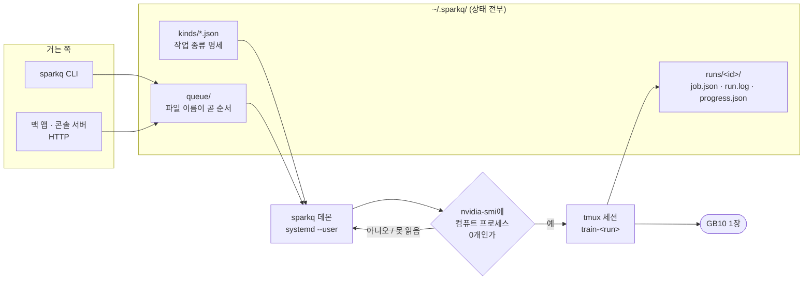
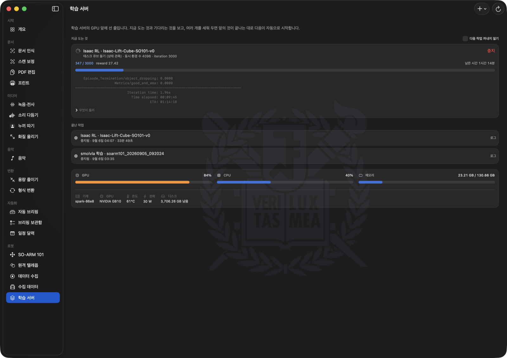

# sparkq — GPU 하나 앞에 학습을 줄 세우는 작업 큐

학습을 손으로 하나씩 띄우고 끝나기를 기다리는 대신, 큐에 걸어 두면 앞의 것이 끝나는 대로
다음이 자동으로 시작됨. 표준 라이브러리만 쓰므로 의존성이 없고, 상태는 전부 `~/.sparkq/`
아래 파일임. 데몬은 그 파일을 읽어 tmux 안에 작업을 띄우는 얇은 층이고, 조작은 `127.0.0.1`의
HTTP로만 받음.

**DGX Spark(리눅스 + NVIDIA)와 Apple Silicon 맥에서 같은 코드가 돔.** 기계에 묶인 것은
`probe/` 아래 다섯 함수뿐이고, 큐의 규칙·작업 종류·진행률·HTTP는 두 기계가 그대로 나눠 씀.

> *A dependency-free job queue that serializes training runs in front of a single GPU. Runs on
> both an NVIDIA DGX Spark (systemd) and an Apple Silicon Mac (launchd) from the same code —
> everything machine-specific lives in `probe/`. State lives as files under `~/.sparkq/`; the
> daemon launches each job inside tmux. Standard library only. Documentation is in Korean.*

이것은 [seoul-local-agent](https://github.com/sesepark/seoul-local-agent)의 로봇 파이프라인
가운데 **학습을 맡는 기계**에서 도는 부분임. 팔과 카메라가 붙은
[콘솔 서버](https://github.com/sesepark/soarm101-console)는 별개다.

---

> **에이전트라면** — 이 기계에서 GPU를 쓰는 것은 무엇이든 이 큐를 통해서만 띄움.
> 규칙과 실제로 깨졌던 사례는 [AGENTS.md](AGENTS.md)에, 서버 홈에 놓는 짧은 안내는
> [AGENTS-home.md](AGENTS-home.md)에 있음. 무엇을 띄우기 전에 그것부터 읽는다.

## 왜 만들었나

이 기계의 희소 자원은 GB10 한 장이다. 그래서 슬롯은 하나이고, 큐는 한 번에 하나만 돌림.
통합메모리라 두 학습이 겹치면 OOM으로 깨지는 대신 **둘 다 스왑으로 느려지는** 방식으로
망가지는데, 그쪽이 훨씬 알아채기 어려움. 겹치지 않게 하는 것이 이 프로그램의 전부임.



## 설계에서 신경 쓴 부분

- **슬롯 하나, 비선점.** 시작한 작업은 끝나거나 사람이 세울 때까지 둠. 학습은 몇 시간짜리라
  중간에 뺏으면 처음부터 다시 해야 하기 때문임. 아직 시작하지 않은 줄은 얼마든지 다시 세울 수
  있음(`top`).
- **상태는 디스크에.** `~/.sparkq/queue/`의 파일 이름이 곧 순서(우선순위 → 들어온 시각)이고,
  실행 중인 것은 `~/.sparkq/runs/<id>/`에 `job.json`·`run.log`·`progress.json`으로 남음.
  데몬이 `systemctl --user restart` 돼도 도는 학습은 tmux 안에서 그대로 돌고, 올라온 데몬이
  세션 이름으로 다시 찾아 붙음.
- **GPU가 실제로 비었을 때만 다음을 꺼냄.** 앞 작업이 끝났는지가 아니라 `nvidia-smi`에 컴퓨트
  프로세스가 하나도 없는지를 봄. 사람이 터미널에서 직접 띄운 학습 위에 올라타지 않기 위해서임.
  nvidia-smi를 못 읽으면(빈 목록과 다르다) 시작하지 않고 기다림.
- **작업 종류는 코드가 아니라 파일로 늘림.** `kinds/*.json` 하나가 종류 하나라, 새 실험을 걸 수
  있게 하는 데 코드를 고칠 필요가 없음. 대신 그 JSON이 셸 명령을 만들므로 값은 목록(`enum`)과
  범위(`int`)와 이름(`name`)으로만 받음 — 자유 문자열 형식은 일부러 없다. 그것이 들어가는 순간
  이 큐는 원격 셸이 되기 때문임.
- **무엇이 돌 것인지 걸 때 확정함.** `${이름}`은 `string.Template`으로 치환되고, 만들어 낸 셸
  명령은 **걸 때** 확정되어 작업 파일에 그대로 적힘. 사람이 보지 않는 동안 도는 것들이라,
  무엇이 돌 것인지 미리 읽을 수 있어야 하기 때문임.

## 구성

```
sparkq.py            큐 · 데몬 · CLI · HTTP 서버 전부 (표준 라이브러리만)
probe/               기계에 묶인 것만 (아래 표)
  linux.py             nvidia-smi · /proc · timeout
  darwin.py            ioreg · vm_stat · host_statistics · pmset · caffeinate
sparkq.service       systemd --user 유닛 (리눅스)
sparkq.macos.plist   LaunchAgent (맥)
install.sh           linger 켜기와 서비스 등록 (리눅스)
install-macos.sh     LaunchAgent 등록 (맥)
kinds/               리눅스에서 걸 수 있는 작업 종류 (JSON 하나가 종류 하나)
  lerobot-train.json   LeRobot 정책 학습 (act | smolvla)
  isaac-rl.json        Isaac Lab 강화학습
  isaac-play.json      Isaac 뷰어 (곁다리 레인)
kinds-macos/         맥에서 걸 수 있는 작업 종류
  lerobot-train.json   LeRobot 정책 학습 — 밤 하나에 들어가는 크기로 프리셋
  lerobot-resume.json  지난 밤에 멈춘 학습을 이어 붙이기
```

### 기계에 묶인 다섯 가지

| | 리눅스 (`probe/linux.py`) | 맥 (`probe/darwin.py`) |
|---|---|---|
| GPU를 쥔 프로세스 | `nvidia-smi --query-compute-apps` | **볼 수 없음** — 문지기에서 이 검사가 빠짐 |
| 기계 상태 | nvidia-smi · `/proc/stat` · `/proc/meminfo` | `ioreg` · `host_statistics` · `vm_stat` · `pmset` |
| 프로세스 트리 | `/proc/<pid>/task/<pid>/children` | `ps -A -o pid=,ppid=`를 한 번 읽어 뒤집음 |
| 잡을 감싸는 것 | 없음 | `caffeinate -i -m -s` — 잡이 도는 동안만 안 잠듦 |
| 곁다리 시한 | `timeout` | `gtimeout`(coreutils). 없으면 곁다리를 **띄우지 않음** |

`gpu_processes`가 거짓인 기계는 `/api/queue`에서 `gpu_apps`를 **아예 싣지 않음.** 빈 목록으로
실으면 "확인했고 비어 있다"로 읽히는데 실제로는 확인할 방법이 없었던 것이고, 그 둘은 사람이
할 일이 정반대임. 무엇을 확인할 수 있는지는 `/api/status`의 `capabilities`가 말함.

## 설치

### 리눅스 (systemd)

```bash
bash install.sh
```

`loginctl enable-linger`를 켜고(한 번 sudo) 사용자 systemd 서비스로 올림. linger가 없으면
로그아웃과 동시에 사용자 유닛이 죽어, 사람이 보지 않는 동안 도는 것이 목적인 이 큐가 의미를 잃음.

되돌리기:

```bash
systemctl --user disable --now sparkq
sudo loginctl disable-linger "$USER"
```

### 맥 (launchd)

```bash
brew install tmux          # 학습은 tmux 안에서 돈다
bash install-macos.sh
```

포트는 **8093**임. 8092를 쓰지 않는 이유는 맥에서 Spark의 큐로 가는 SSH 터널이 그 번호를
이미 잡고 있어서, 같은 번호면 둘 중 하나가 뜨지 못하기 때문임.

`linger`에 해당하는 것이 없음 — LaunchAgent는 **로그인해 있는 동안** 돔. 로그인 화면에
머물러 있으면 큐도 서지 않으므로 밤새 돌릴 때는 로그인한 채로 두어야 함. 그리고 외장
디스플레이 없이 **뚜껑을 닫으면 `caffeinate`로도 못 막음** — 뚜껑은 열어 두어야 함.

되돌리기:

```bash
launchctl bootout gui/$(id -u)/com.sesepark.sparkq
rm ~/Library/LaunchAgents/com.sesepark.sparkq.plist
```

## 쓰기

```bash
sparkq ls                 # 지금 도는 것과 대기열, 최근 끝난 것
sparkq kinds              # 걸 수 있는 작업 종류
sparkq add <종류> 이름=값 …  # 줄 맨 뒤에 세운다
sparkq top <id>           # 아직 시작 안 한 작업을 맨 앞으로
sparkq rm <id>            # 대기 취소 또는 도는 작업 중지
sparkq log <id>           # 로그 꼬리
sparkq pause / resume     # 다음 작업을 꺼낼지 말지
```

맥에서는 포트가 다르므로 앞에 붙여 부름:

```bash
SPARKQ_PORT=8093 sparkq ls
```

기본으로 딸려 오는 두 종류:

```bash
sparkq add lerobot-train dataset=<이름> policy=act        # LeRobot 정책 학습 (act | smolvla)
sparkq add isaac-rl task=Isaac-Lift-Cube-SO101-v0 num_envs=4096 max_iterations=2500
```



<sub>큐를 읽는 쪽의 예 — [seoul-local-agent](https://github.com/sesepark/seoul-local-agent)의
`학습 서버` 화면이 `/api/queue`와 `/api/status`를 그대로 그린 것. 진행·남은 시간은 `progress.json`,
GPU·온도·전력은 `/api/status`에서 옴.</sub>

## HTTP API

`127.0.0.1:8092`(기본). LAN에 여는 길은 만들지 않음 — 신뢰 경계는 이 앞의 SSH 터널이다.

| 메서드 | 경로 | 하는 일 |
|---|---|---|
| GET | `/api/status` | 기계 한 줌: GPU 온도·전력·사용률, CPU·메모리 사용률, 디스크, 대기 개수 |
| GET | `/api/kinds` | 걸 수 있는 작업 종류와 칸 명세 |
| GET | `/api/datasets` | `~/data/soarm` 아래에 와 있는 데이터셋 |
| GET | `/api/runs` | 학습이 남긴 것 — 실행마다 체크포인트·크기·지금 쓰는 중인지 |
| DELETE | `/api/runs/{run}` | 실행 하나를 통째로 (옆자리 `.runs/{run}`의 로그도 함께) |
| DELETE | `/api/runs/{run}/checkpoints/{step}` | 체크포인트 하나 |
| DELETE | `/api/runs/{run}/checkpoints/{step}/training_state` | optimizer 상태만 — 가중치는 남는다 |
| GET | `/api/queue` | 도는 것 1 + 대기열 + 최근 끝난 것 + 큐 밖의 GPU 프로세스 |
| POST | `/api/queue` | `{"kind": …, "params": {…}}` |
| DELETE | `/api/queue/{id}` | 대기면 빼고, 도는 중이면 세운다 |
| POST | `/api/queue/{id}/top` | 맨 앞으로 |
| POST | `/api/queue/pause` | `{"paused": true\|false}` |
| GET | `/api/queue/{id}/log` | 로그 꼬리 |
| GET | `/api/queue/{id}/series` | 값의 흐름 — LeRobot은 손실·검증 손실, Isaac은 평균 보상 |

### 학습이 남긴 것

이 기계의 GPU를 큐가 소유하듯, 이 기계의 `~/outputs`도 큐가 소유한다. 다른 기계가 ssh로
들어와 지우는 구조를 만들지 않는 이유는 같다 — 무엇이 지금 쓰이고 있는지 아는 곳이 여기뿐이다.

`/api/runs`의 한 줄은 실행 하나이고, 체크포인트마다 **가중치와 optimizer 상태를 따로** 센다.

```json
{"name": "soarm101_…__smolvla__e315", "policy": "smolvla", "step": 20000, "steps": 20000,
 "bytes": 5033164800, "in_use": null,
 "checkpoints": [{"step": "005000", "model_bytes": 907018240, "state_bytes": 413138944,
                  "bytes": 1320157184, "finished_at": 1757…}]}
```

두 숫자를 나눠 두는 이유는 잃는 것이 다르기 때문이다. `training_state`는 **이어붙일 때만**
쓰이고 추론에는 필요 없는데 체크포인트의 3분의 1쯤을 차지한다(실측 865MB 대 394MB). 그것만
지우면 이어붙일 권리를 버리고 가중치는 남으므로, 그 체크포인트는 여전히 팔로 보내 돌릴 수 있다.

`in_use`가 비어 있지 않으면 지우기는 409로 거절된다. 도는 학습뿐 아니라 **아직 시작하지 않은**
작업이 가리키는 실행도 막는다 — 대기 중인 `lerobot-resume`이 가리키는 폴더를 지우면 그 작업은
새벽에 시작해 몇 초 만에 죽고, 아침에 남는 것은 실패 한 줄과 날아간 밤 하나다.

체크포인트 하나를 지우면 `checkpoints/last` 링크를 남은 것 가운데 마지막으로 옮긴다. 그러지
않으면 끊어진 링크가 남고, 실행을 알아보는 표지가 그 링크 너머의 `train_config.json`이라
**실행 전체가 목록에서 사라진다** — 지운 것은 체크포인트 하나였는데.

```bash
sparkq runs                              # 무엇이 얼마를 차지하고 있나
sparkq rm-ckpt <run> <step> --state-only # 이어붙이기만 버리고 가중치는 남긴다
sparkq rm-run  <run>                     # 통째로
```

## 작업 종류 만들기

`kinds/`에 JSON 하나를 놓으면 됨.

```json
{
  "kind": "lerobot-train",
  "title": "${policy} 학습 · ${dataset}",
  "label": "데이터셋 학습",
  "fields": [
    {"name": "dataset", "label": "데이터셋", "type": "name", "source": "datasets"},
    {"name": "policy", "label": "정책", "type": "enum", "values": ["act", "smolvla"],
     "default": "act", "presets": {"act": {"steps": 100000, "batch_size": 64}}}
  ],
  "derived": [{"name": "run", "template": "${dataset_short}__${policy}__${token}"}],
  "session": "train-${run}",
  "progress": "lerobot",
  "run": "…셸 스크립트…"
}
```

세션 이름은 반드시 `train-`으로 시작해야 함(데몬이 강제한다). 같은 GPU를 쓰는 다른 문 — 콘솔
서버의 학습 시작 — 이 그 접두사로만 "이미 도는 학습"을 알아보기 때문임.

## 한계와 주의

- **이 기계 한 대를 위해 만든 것임.** 슬롯 하나·GPU 하나를 전제로 하고, 여러 노드나 여러 GPU를
  나눠 쓰는 스케줄링은 없음.
- 인증이 없음. `127.0.0.1`에만 붙고, 밖에서 오는 것은 SSH 터널을 지나야 함. LAN에 여는 설정은
  일부러 만들지 않았음.
- 실패한 작업을 자동으로 다시 걸지 않음. 왜 죽었는지 사람이 읽고 다시 거는 편이 낫다고 봄.
- 딸려 오는 두 작업 종류는 이 기계의 환경을 가정함. `kinds/lerobot-train.json`이
  `~/venvs/lerobot`을 활성화하고, 데이터셋은 `~/data/soarm` 아래에서 찾음(`SPARKQ_DATASETS`로
  바꿀 수 있음). 다른 기계에서 쓰려면 그 JSON을 먼저 고쳐야 함.
